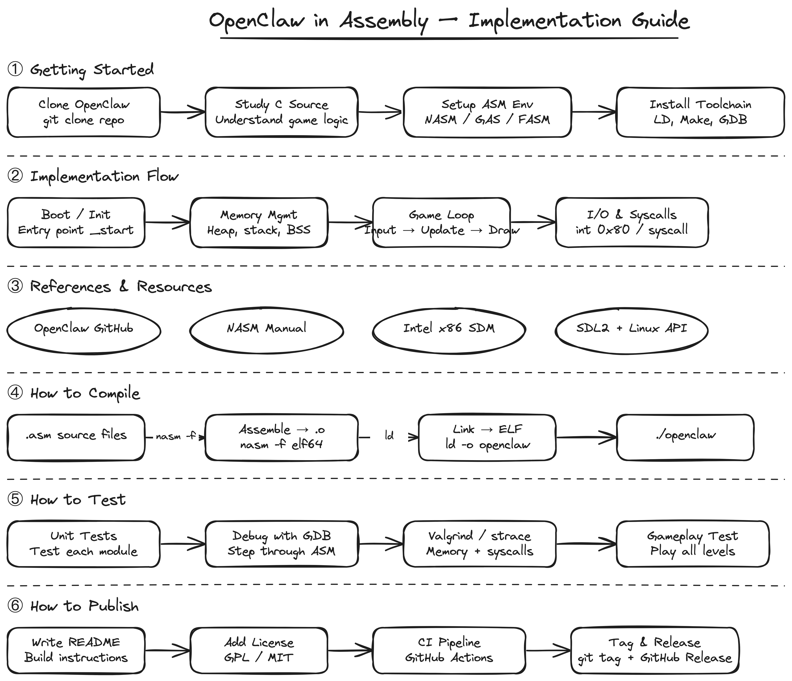

# hand-drawn-diagrams

AI skill for turning ideas, notes, systems, and flows into hand-drawn diagrams — with a hosted edit URL, animated video, and PNG, all from a single prompt.

**Jump to:** [What this is](#what-this-is) · [Output](#output) · [Quick start](#quick-start) · [Credits](#credits-and-acknowledgements)


### Example output

Static PNG — exported on request:



Animated SVG — draws itself stroke by stroke ([view](assets/diagram.animated.svg)):


## What this is

**hand-drawn-diagrams** is an AI skill (for Claude Code, Codex CLI, and compatible agents) that takes a natural language prompt and produces a hand-drawn diagram you can edit, animate, and share — without opening any app.

You describe what you want. The AI picks the right diagram type, draws it in Excalidraw's sketch style, validates the layout, and hands you a live hosted URL. From there you can edit it in a browser, watch it animate, download the source, or export a PNG.


## How it's different from using Excalidraw directly

| | Excalidraw | hand-drawn-diagrams |
|---|---|---|
| Starting point | Blank canvas, you draw | Natural language prompt |
| Diagram type | You decide | AI picks the right route (teaching, UX, architecture, funnel…) |
| Layout | You position everything | AI assigns non-overlapping coordinates |
| Animation | Manual or none | Auto-generated animation spec, renders in browser |
| Output | File on disk | Hosted edit URL + animated SVG + PNG on request |
| Workspace | You open the app | Files stay in `/tmp/` by default — workspace stays clean |

This skill is not a replacement for Excalidraw — it sits on top of it. Every diagram it produces is a standard `.excalidraw` file you can open, edit, and own.

## Best for

- students: study notes and exam revision maps
- teachers: lesson explainers and concept breakdowns
- architects: system and API flow diagrams
- builders: sequence diagrams and integration maps
- designers: UX flows and wireframes
- product: idea maps and feature flows
- sales: funnel and conversion visuals
- doctors: process and patient-facing explainers

## Output

The agent infers what you want from your prompt and routes to the right output automatically:

| What you ask for | What you get |
|---|---|
| "create a diagram" / default | Browser opens to hosted Excalidraw editor — edit, tweak, download |
| "open the animation" | Browser opens animated view — diagram draws itself stroke by stroke |
| "save as excalidraw" | `.excalidraw` source file saved to your project |
| "save the animation" | `.animated.svg` saved to your project — plays in any browser |
| "save image" | `.png` saved to your project |
| "show image" | `.png` rendered and opened with your system viewer |

Source files go to `/tmp/hand-drawn-diagrams/` by default — your workspace stays clean.

## Quick start

```bash
npx skills add muthuishere/hand-drawn-diagrams
```

Works for Claude Code, Codex, OpenCode, Windsurf, GitHub Copilot, Cursor, Gemini CLI, and 40+ more agents. Detects which agents you have installed automatically.

For all install options, global vs project scope, and uninstall — see [INSTALL.md](INSTALL.md).

## Credits and acknowledgements

This skill stands on the shoulders of excellent open-source work:

- **[Excalidraw](https://excalidraw.com/)** — the open-source virtual whiteboard that powers the hand-drawn visual style and the hosted editor. All diagrams produced by this skill are standard Excalidraw files.
  GitHub: [excalidraw/excalidraw](https://github.com/excalidraw/excalidraw)

- **[excalidraw-animate](https://github.com/dai-shi/excalidraw-animate)** by [@dai-shi](https://github.com/dai-shi) — the animation library that renders Excalidraw diagrams as SVGs that draw themselves stroke by stroke. The animated SVG output in this skill is powered by this library.

## License

MIT — see [LICENSE](LICENSE).
