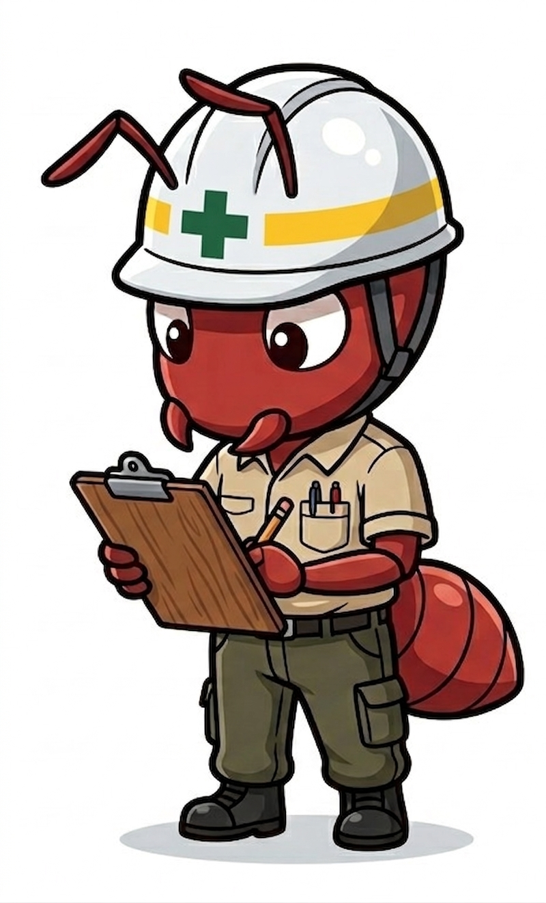
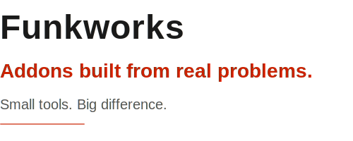

<p align="center">
  
  
</p>

<p align="center">
  <a href="https://github.com/kleer001/funkworks/blob/main/LICENSE"></a>
  <a href="https://www.python.org/"></a>
  <a href="https://www.blender.org/"></a>
  <a href="https://www.sidefx.com/"></a>
  <a href="https://github.com/kleer001/funkworks/commits/main"></a>
  <a href="https://github.com/kleer001/funkworks/issues"></a>
  <a href="https://github.com/kleer001/funkworks/network/members"></a>
  <a href="https://github.com/kleer001/funkworks/watchers"></a>
  <a href="https://github.com/kleer001/funkworks/stargazers"></a>
</p>

<p align="center">
  <strong>Addons built from real problems.</strong> &middot; <em>Small tools. Big difference.</em>
</p>

---

Free addons that eliminate repetitive workflow steps for digital artists.

Starting with Blender and r/blender, the goal is to expand across DCC tools (Houdini, Maya, Cinema 4D, etc.) and artist communities — automatically surfacing pain points and shipping targeted solutions wherever artists are struggling.

## Plugins

### Blender

| Plugin | Description |
|--------|-------------|
| [Fluid Domain Auto-Visibility](plugins/blender/docs/fluid_domain_visibility/) | One-click visibility keyframing for fluid simulation domains |
| [Selective Edge Split](plugins/blender/docs/selective_edge_split/) | Split panel gap edges without touching render sharps |

### Houdini

| Plugin | Description |
|--------|-------------|
| [Scale COP](plugins/houdini/docs/scale_cop/) | Scale, fit, and tile images in Copernicus — letterbox, fill, crop, and tiling in one node |

**Tutorials & docs:** [kleer001.github.io/funkworks](https://kleer001.github.io/funkworks)

## Research Pipeline

Plugin ideas are sourced from r/blender using a two-stage pipeline:

```bash
# 1. Crawl Reddit for pain points (requires .env with REDDIT_USER_AGENT)
python -m src.crawlers.reddit

# 2. Classify raw posts with Claude to find plugin opportunities
python -m src.digest.agent data/raw/<raw_file>.json data/digests/<output>.json
```

Output lands in `data/digests/` as JSON files with classified opportunities.

### Setup

```bash
pip install -r requirements.txt
cp .env.example .env
# Edit .env — set REDDIT_USER_AGENT=funkworks/0.1 by u/YOUR_USERNAME
```

### Running Tests

```bash
pytest
```

## Adding a New Plugin

**Blender:**
1. Write the addon: `plugins/blender/src/[name].py`
2. Copy `plugins/blender/_template/` to `plugins/blender/docs/[name]/`
3. Fill in `README.md`, `listing.md`, and `announce.md`
4. Add a row to the Blender table above and an entry to `docs/index.md`

**Houdini:**
1. Write the build script: `plugins/houdini/src/build_[name].py`
2. Compile the HDA: `hython plugins/houdini/src/build_[name].py`
3. Copy `plugins/houdini/_template/` to `plugins/houdini/docs/[name]/`
4. Fill in `README.md`, `listing.md`, and `announce.md`
5. Add a row to the Houdini table above and an entry to `docs/index.md`
