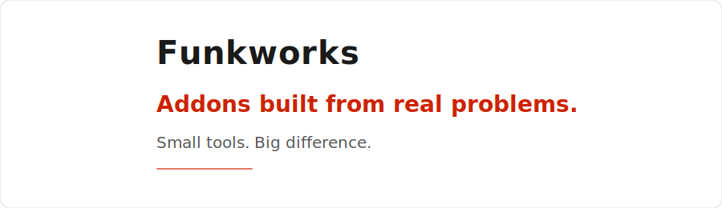

  

Free tools that eliminate repetitive workflow steps for digital artists. Built from real pain points, shipped as single-file addons and HDAs.

---

  

    

      
    

    

      <h3><a href="selective_edge_split">Selective Edge Split</a></h3>
      
Split panel gap edges without touching your render sharps. Tag edges once with Ctrl+E, apply a scoped split when ready.

      
Blender 4.0+ &middot; Free

      

        <a href="https://kleer001.github.io/funkworks/selective_edge_split">Tutorial &amp; Download</a>
        <a href="https://github.com/kleer001/funkworks/tree/main/plugins/blender/src/selective_edge_split.py">Source</a>
      

    

    

      <ul>
        <li><a href="https://old.reddit.com/r/blender/comments/1soevvw/free_addon_split_panel_gap_edges_without_touching/">r/blender</a></li>
        <li><a href="https://blenderartists.org/t/free-addon-split-panel-gap-edges-without-touching-your-render-sharps/1637935">BlenderArtists</a></li>
      </ul>
    

  

  

    

      
    

    

      <h3><a href="fluid-domain-visibility">Fluid Domain Auto-Visibility</a></h3>
      
One-click visibility keyframing for fluid simulation domains. Automatically hides the domain box before your sim starts.

      
Blender 4.0+ &middot; Free

      

        <a href="https://kleer001.github.io/funkworks/fluid-domain-visibility">Tutorial &amp; Download</a>
        <a href="https://github.com/kleer001/funkworks/tree/main/plugins/blender/src/fluid_domain_visibility.py">Source</a>
      

    

    

      <ul>
        <li><a href="https://www.reddit.com/r/blender/comments/1s4ep4o/free_addon_stop_manually_hiding_your_fluid_domain/">r/blender</a></li>
        <li><a href="https://blenderartists.org/t/free-addon-stop-manually-hiding-your-fluid-domain-before-the-sim-starts/1635474">BlenderArtists</a></li>
      </ul>
    

  

  

    

      
    

    

      <h3><a href="scale_cop">Scale COP</a></h3>
      
Resize and reposition an image in Houdini Copernicus with independent fit mode, tiling, and resampling filter. Letterbox, fill, crop, and tile in one node.

      
Houdini 20+ &middot; Free

      

        <a href="https://kleer001.github.io/funkworks/scale_cop">Tutorial &amp; Download</a>
        <a href="https://github.com/kleer001/funkworks/tree/main/plugins/houdini/src/build_scale_cop.py">Source</a>
      

    

    

      <ul>
        <li><a href="https://www.sidefx.com/forum/topic/103565/?page=1#post-458117">SideFX Forums</a></li>
        <li><a href="https://forums.odforce.net/topic/67424-scale-cop-%E2%80%94-free-houdini-node-for-fit-modes-tiling-and-canvas-resize-letterbox-fill-crop/#comment-277858">OdForce</a></li>
      </ul>
    

  

  

    

      
    

    

      <h3><a href="zoom_blur_cop">Zoom / Radial Blur COP</a></h3>
      
Zoom blur and spin blur in one Houdini Copernicus node. Switch between radial scale and arc modes, place the center in screen space or pixels, tune sample count for quality vs. speed.

      
Houdini 20.5+ &middot; Free

      

        <a href="https://kleer001.github.io/funkworks/zoom_blur_cop">Tutorial &amp; Download</a>
        <a href="https://github.com/kleer001/funkworks/tree/main/plugins/houdini/src/build_zoom_blur_cop.py">Source</a>
      

    

    

      <ul>
        <li><a href="https://www.sidefx.com/forum/topic/103658/?page=1#post-458829">SideFX Forums</a></li>
        <li><a href="https://forums.odforce.net/topic/67448-zoom-radial-blur-cop/">OdForce</a></li>
      </ul>
    

  

---

[View on GitHub](https://github.com/kleer001/funkworks)
