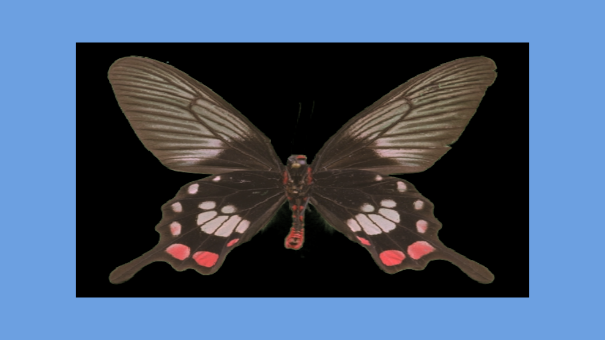
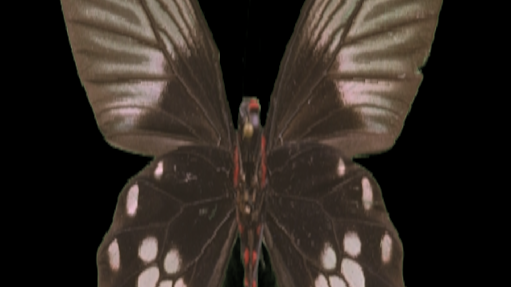
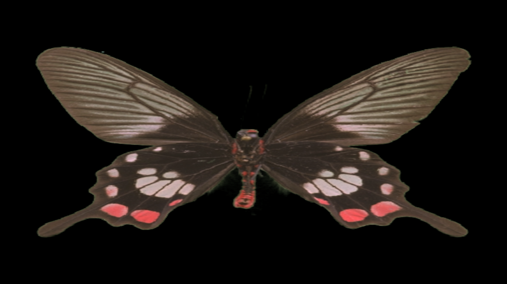
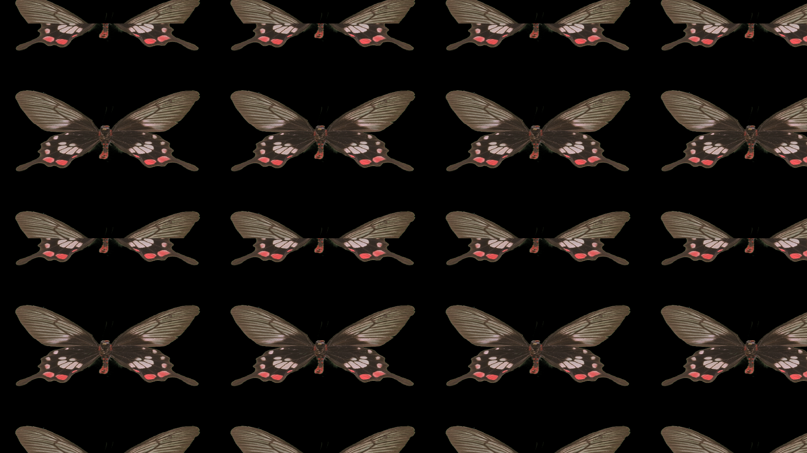
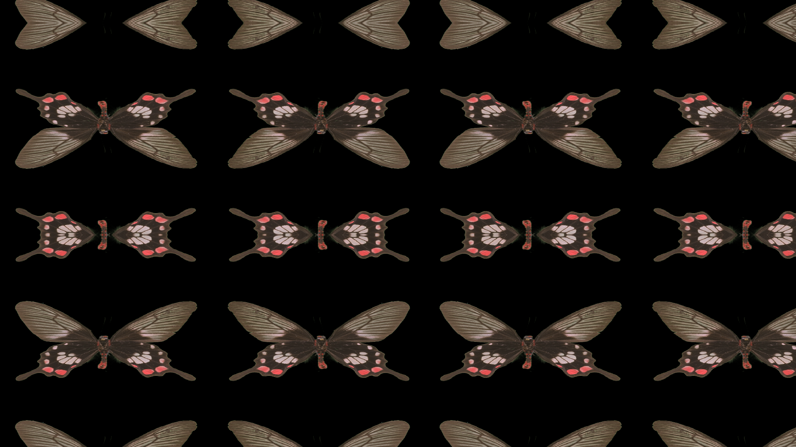

Resize and reposition an image within a target canvas, with independent control over fit mode, tiling, and resampling filter.

[Download HDA](https://github.com/kleer001/funkworks/raw/main/plugins/houdini/src/scale_cop.hda){: .btn} &nbsp; [Back to all addons](.)

---

## Inputs

| # | Name | Description |
|---|------|-------------|
| 0 | Source | Image to scale |
| 1 | Size Reference | Optional. When **Use Size Reference** is enabled, this input sets the output canvas resolution |

---

## Parameters

### Target Resolution

**Use Size Reference**
When enabled, the output resolution is taken from the image connected to input 1 instead of the Scale Mode parameters.

**Scale Mode**
How the output canvas size is determined.

| Mode | Description |
|------|-------------|
| Preset | Choose a standard resolution from a menu |
| Explicit | Set Width and Height directly |
| Uniform | Scale the source by a single multiplier |
| Non-Uniform | Scale X and Y independently |

**Preset** _(Preset mode)_
Standard target resolution. Options include 720p, 1080p, 2K, 4K, 8K, DCI 2K, DCI 4K, and square formats (1K, 2K, 4K).

**Width / Height** _(Explicit mode)_
Output canvas size in pixels.

**Constrain Proportions** _(Explicit mode)_
Lock the Width/Height ratio to the source aspect.

**Scale** _(Uniform mode)_
Multiplier applied equally to both axes.

**Scale X / Scale Y** _(Non-Uniform mode)_
Independent per-axis scale multipliers.

---

### Fit Mode

Controls how the source image is placed inside the output canvas.

**Fit Mode**

| Mode | Description |
|------|-------------|
| Distort | Stretch source to fill canvas exactly, ignoring aspect ratio |
| Fit | Scale source to fit entirely inside canvas, preserving aspect. Remaining area filled with Background Color |
| Fill | Scale source to fill canvas entirely, preserving aspect. Content that extends beyond canvas edges is cropped |
| Width | Scale source so its width matches the canvas width |
| Height | Scale source so its height matches the canvas height |
| None | Place source at 1:1 pixel scale, centered |

**Background Color** _(Fit, Width, Height, None modes)_
Color used to fill any canvas area not covered by the source image.

#### Examples

**Fit** — 4:3 source in a 16:9 canvas. Blue fill shows the padding.

**Fill** — Portrait source cropped to fill a landscape canvas. No padding; edges are clipped.

**Distort** — Source stretched to fill the canvas without preserving aspect ratio.

---

### Tiling

Controls how the image repeats beyond its placed bounds. Tiling applies in image-pixel space: the source tile is one source-resolution unit in size.

**Tile Mode**

| Mode | Description |
|------|-------------|
| None | No tiling. Areas outside the placed image use Background Color |
| Repeat | Tile the image with simple translation |
| Mirror X | Mirror the image horizontally on each repeat |
| Mirror Y | Mirror the image vertically on each repeat |
| Mirror Both | Mirror on both axes |

**Tile Offset X / Tile Offset Y** _(any mode except None)_
Shift the tile origin in UV space. Values wrap at ±1.

#### Examples

**Repeat** — 512×512 source tiled to fill a 1920×1080 canvas.

**Mirror Both** — Same source tiled with bilateral mirroring.

---

### Resampling

**Filter**
Reconstruction filter used when scaling the source.

| Filter | Notes |
|--------|-------|
| Auto | Bilinear for magnification, Catmull-Rom for minification |
| Point | Nearest-neighbour. Fastest; aliased |
| Bilinear | Smooth, slightly soft |
| Box | Simple box filter |
| Bartlett | Triangular filter |
| Catmull-Rom | Sharp, good general-purpose filter |
| Mitchell | Slight blur; reduces ringing vs Catmull-Rom |
| B-Spline | Smoothest; can appear soft |
